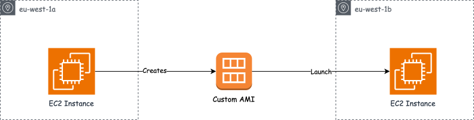

# Compute Instances

## EC2 Instance Types

1. General Purpose Instance -  These instances have a good balance between Compute, Memory and Networking
2. Compute Optimized(C name) - Good for compute intensive tasks such as High performance computing(HPC), Batch Processing, Dedicated Gaming Servers, Machine learning
3. Memory Optimized(RAM, R name ) - processing large datasets in memory - Databases, Distributed Cache, In memory db, Real time processing of big unstructed data
4. Storage Optimized(I or D name) - Storage intensive task such as read and writing of large datasets on local storage - Cache, Data warehouse, OLTP, Distributed File Systems

Reference - https://ec2instances.github.io/

## EC2 Instance Purchasing Options 

1. On-Demand Instances - Short workload and uninterrupted workloads where you can't predict application behaviour
2. Reserved Instances - Long workload, Reservation can run from 1 year or 3 years and not 1 to 3 years. This is used for applications with steady state and predictable behaviour
3. Spot Instance - Short workload, very cheap but can loose instance at any time.
4. Dedicated Instances - You have a dedicated server
5. EC2 saving plans can also work for long term usage and very flexible when it comes to instance size, OS and tenancy
6. Dedicated Host - You have access to the hardware or the physical server

## EC2 Instance Workloads

<table>
  <tr><th>Instance Type</th><th>Description</th><th>Good For</th><th>Bad For</th></tr>
  <tr>
    <td>Spot</td>
    <td>Spare AWS capacity sold at a steep discount (up to ~90% off On-Demand), reclaimable with as little as a 2-minute warning — the workload has to survive that without breaking.</td>
    <td>Stateless, fault-tolerant, flexible workloads (big data, orchestrated containers, CI/CD, stateless web servers, checkpointed HPC, queue-based rendering) — because these can lose an instance mid-task and have the work resumed or rescheduled elsewhere without losing progress or breaking the system.</td>
    <td>Stateful single-instance apps, primary databases, latency-critical production APIs — because losing the instance means losing data that was never replicated, or breaking an SLA the moment capacity is reclaimed, with no fallback mechanism to absorb the interruption.</td>
  </tr>
  <tr>
    <td>On-Demand</td>
    <td>Pay-as-you-go compute with no commitment or contract — standard hourly/per-second rate, start and stop anytime.</td>
    <td>Unpredictable or spiky workloads, short-term tasks, dev/test environments — because you avoid committing to usage you can't forecast, and you only pay for what you actually run.</td>
    <td>Steady-state predictable workloads and large interruption-tolerant batch jobs — because you end up paying the highest rate for usage that a Reserved Instance/Savings Plan (predictable) or Spot (interruptible) would cover far more cheaply.</td>
  </tr>
  <tr>
    <td>Reserved</td>
    <td>A 1- or 3-year commitment to a specific instance type/family in a specific region, in exchange for a significant discount over On-Demand.</td>
    <td>Steady-state, predictable long-term workloads (production databases, baseline application servers) — because the discount rewards guaranteed usage, and these workloads run continuously anyway so the commitment carries no real risk.</td>
    <td>Unpredictable or short-term workloads, or ones likely to change instance type/region — because you're locked into paying for that capacity regardless of whether you use it, and switching instance families or regions can strand the commitment.</td>
  </tr>
  <tr>
    <td>Dedicated</td>
    <td>Instances (or entire physical hosts) running on hardware isolated to a single customer, with no shared tenancy at the hardware level.</td>
    <td>Regulatory/compliance mandates for physical isolation, licensing tied to physical cores or sockets — because these requirements can only be satisfied by guaranteeing no other customer's workload shares the same physical hardware.</td>
    <td>Cost-sensitive workloads with no compliance need — because you pay a substantial premium purely for hardware isolation you don't actually require, with no performance or reliability benefit over shared tenancy.</td>
  </tr>
  <tr>
    <td>Savings Plans</td>
    <td>A 1- or 3-year commitment to a consistent $/hour of compute spend, applied automatically and flexibly across instance families, sizes, regions, and sometimes across EC2/Fargate/Lambda.</td>
    <td>Steady baseline spend with infrastructure that's still evolving — because the discount applies automatically even if you change instance type, size, or move workloads between compute services, unlike a Reserved Instance's rigid commitment.</td>
    <td>Highly unpredictable spend or very short-term projects — because you're billed for the committed $/hour regardless of actual usage, so spend that drops below the commitment is wasted money you can't recover.</td>
  </tr>
</table>

### Spot instance Request and Spot Fleet!!!

up to 90% discount can gotten when using spot instance compared to on-demand.

#### How Spot Requests Works and How to terminate them - Very Important

when creating a request for a spot instance the following needs to be determined:

1. Maximum Price you are going to pay
2. Desired Number Of instance
3. Launch Specification
4. Request is Valid From and Request Valid Until
5. Request Type - The request type is of two types namely One-Time and persistent.
  For One-Time Request for spot instances as soon as your spot request is fufilled your instances are up and running and your request gets deleted.
  For persistent if your instances get stopped, your request would restart the instances for you as long as there is a valid from and valid until is set.
  A spot request can only be canceled if the status is OPEN, ACTIVE and DISABLED. Cancelling doesnt terminate the instances, if you terminate before cancelling, the request would start new ones so you need to cancel first then terminate

### Spot Fleet

Spot fleet is a process of launching a fleet of tens, hundreds of instances in a single operation. These instance can be  spot instances and on-demand(optional) instances. You can define multiple lunch pools so that the fleet can choose.

There are different strategies to allocating spot instances:

1. Lowest Price - Fleets would be lunched from the poll with the lowest price and the benefit is cost optimization and better for short workload
2. Diversified - Fleets distributed across pools which gives high availability and better for long workloads
3. Capacity Optimized - Pool with optimal capacity for the number of instance
4. PriceCapacityOptimized - Pools with the highest capacity available where you can also select the pool with the lowest price

## EC2 Hibernate

EC2 Hibernation saves the contents from the instance memory (RAM) to your Amazon Elastic Block Store (Amazon EBS) root volume.Amazon EC2 persists the instance's EBS root volume and any attached EBS data volumes

### Reference

https://docs.aws.amazon.com/AWSEC2/latest/UserGuide/Hibernate.html

## AMI Process

AMI Amazon Machine Image OS is imahge that provides software that is required to setup and boot EC2 Instances. You can create an AMI from your Amazon EC2 instances and then use it to launch instances with the same configuration.

 