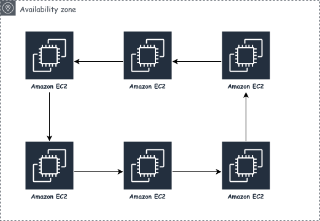
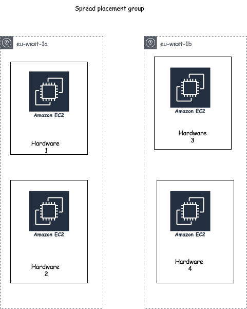
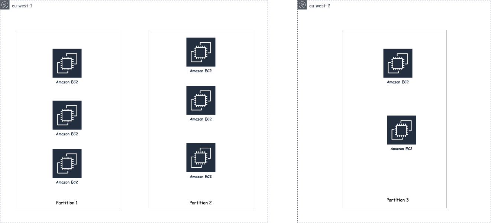
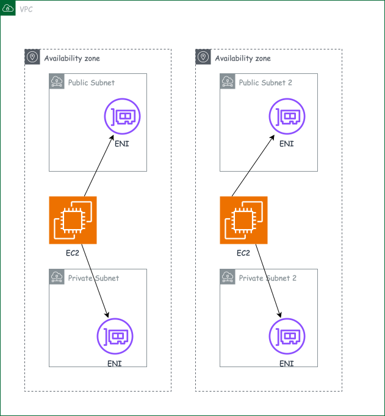

# AWS Network Architecture

## Why Elastic IPs Replect Poor Architectural Decisions

Everytime an EC2 starts and stops the public IP is changed, why? There is a limited number of IPV4 addresses and AWS has to share the pool of IPV4 addresses with millions of accounts and instances. There is no point allowing an instance hold on to its public IP because at that moments its not being used. So when an instance is stopped, AWS reclaims the IP for another to use.

While elastic IP solves the above problems. Its more a solution that mask an underlying architectural issue. The architecural issues includes the following

1. Single Point Of Failure - Elastic Ip has a 1 to 1 relationship with an instance. If the instance dies, you'd have to manually remap the EIP to a new instance instead of relying on availability technqiues such as load balancing or Auto Scaling

2. EIP does scale horizontally  - Because they are 1 to 1 and the EIP force traffic to only one instance, you cant have multiple instances behind a single EIP which forces vertical scaling

Solutions can be either to use load balancer or a random public IP mapped to a DNS name.

## Placement Groups

Placement groups enables users to influence how instances are placed on underlying hardware.

- Cluster Strategy Placement Group : Enables applications with tightly coulped node to node communication to achieve low lantency network performance by putting all the EC2 in a single AZ.
    Tradeoff - Users goal is low latency and high network througput and because of this goal the strategy isn't fault tolerant(Fault tolerance specifically refers to a system's capability to handle faults without any degradation or downtime.) With cluster strategy, you would have correllated failures meaning if the AZ fails,all systems go down.This strategy favors network performance over fault tolerance/availability.

    

- Spread Placement Group: places critical instances on different racks/hardware, with the   goal of high availability and reducing the risk of correlated failures.
    Tradeoff — because the goal is fault isolation, you give up low latency. Instances aren't optimized to be physically close, so inter-instance communication isn't as fast as it would be in a Cluster group. This strategy favors fault tolerance/availability over network performance.

    

- Partition Placement Group: divides a large group of instances into logical partitions, where no two partitions share the same underlying racks, with the goal of reducing correlated failures for large distributed, replicated workloads.
    Tradeoff — because the goal is fault isolation, you give up low latency. Instances aren't optimized to be physically close, so inter-instance communication isn't as fast as it would be in a Cluster group. This strategy favors fault tolerance/availability over network performance, but the isolation is weaker than Spread's since instances within the same partition can still share hardware.

    

### PG Reference

1. <https://medium.com/pinterest-engineering/how-pinterest-runs-kafka-at-scale-ff9c6f735be>
2. <https://aws.amazon.com/blogs/compute/using-partition-placement-groups-for-large-distributed-and-replicated-workloads-in-amazon-ec2/>

## Elastic Network Interface

A physical network card connects computers or servers to a network. A network card facilitates(Makes an action or a process smoother and more likely to happen) communication between a computer/server and a local area network (LAN), wide area network (WAN), or the internet. It serves as an interface that allows the computer/server to connect to a network's physical medium such as copper wire, fiber optic, or wireless transmission. They operate the layer 3 and layer 2 for the infrastructure they are attached to.

A virtual network card is a software based emulation of a physical network card. ENI represent a virtual network card.

 

### ENI Reference

1. <https://www.fs.com/uk/blog/what-is-a-network-interface-card-nic-definition-function-types-526.html>

## Terminologies

1. Correlated Failures - Systems fail together because of an underlying cause
2. Cascading Failures - Failure of a single component, causes the failure of other components
