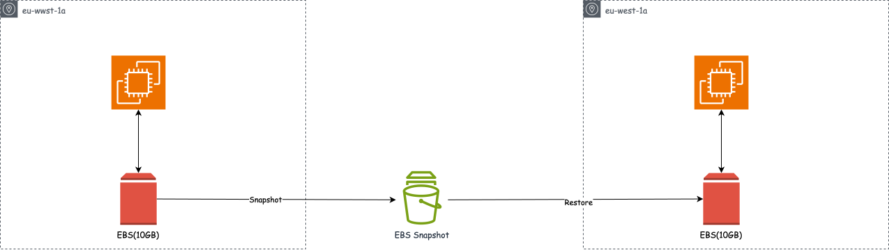

# Storage General Knowlegde

## EBS Elastic Block Store

So think of this like a virtual hard drive(Like a USB Stick) that is attached to your instance while they run. They are used to persist data even after their terminication.

They are bound/locked to a specific AZ and they are easily detachable. Root/ primary EBS are deleted by default whenever the associated instance are terminated but secondary are not deleted by default

 

## EBS Snapshot

Snapshots are point-in-time copies that serves as backed up data. Snapshot are incremental backups which means only blocks on the volume that have changed since the most recent snapshot, This is to prevent data duplication. Snapshots can be copied across region and azs. Very very useful in DR, copy data to another region

 